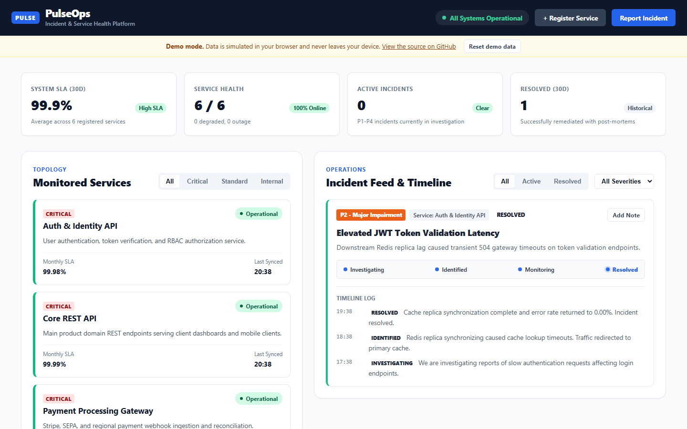
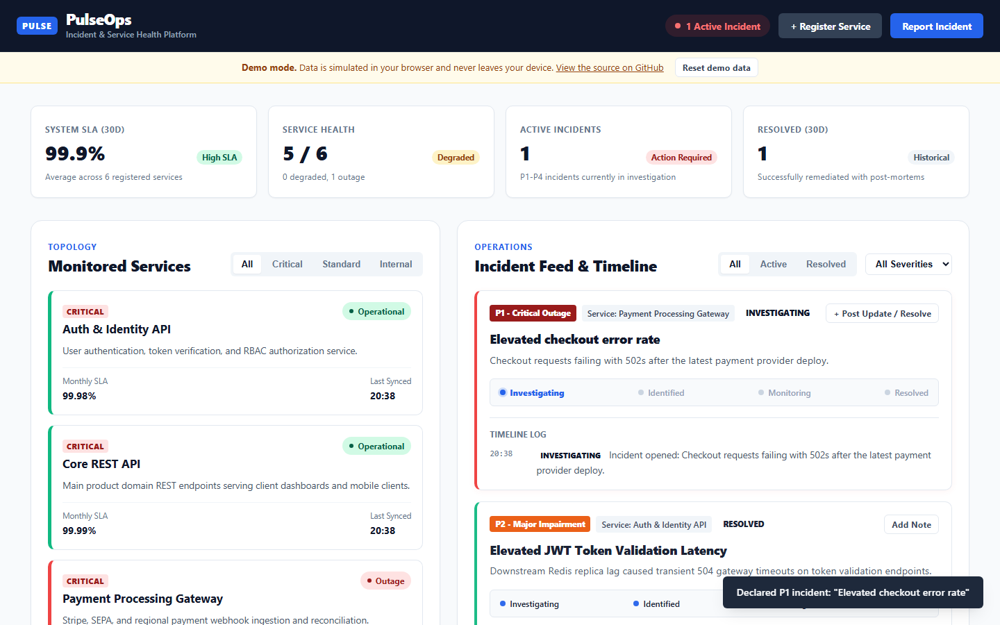
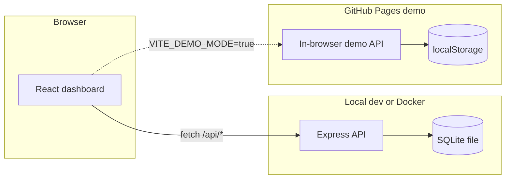

# PulseOps

PulseOps is a dashboard for tracking service health, declaring incidents, and following incident timelines from a single view.

[](https://github.com/Taan1el/pulseops/actions/workflows/ci.yml)
[](https://github.com/Taan1el/pulseops/actions/workflows/pages.yml)
[](LICENSE)

**Live demo:** https://taan1el.github.io/pulseops/

The demo runs entirely in your browser: there is no backend behind it, and the data is simulated and stored in your browser's local storage.

## Screenshots





## Features

- Register services with a name, description, and criticality tier (critical, standard, internal).
- Declare incidents against a service with a title, a severity (P1 to P4), and a summary.
- Post timeline updates on an incident (investigating, identified, monitoring, resolved) with a public note.
- Automatic status transitions: declaring a P1 incident forces the service into outage, a P2 degrades it unless it is already down, and a P3 degrades it only if it was fully operational. Resolving the last active incident on a service restores it to operational.
- Live system metrics: overall SLA (the average of each service's own uptime figure), service health counts, active incident count, and resolved incident count.
- Filter services by tier and incidents by status or severity.
- A persistent error banner with a retry action when the dashboard's data fails to load. If a snapshot was already loaded, that data stays on screen with an outdated-data notice instead of disappearing.
- Keyboard support in the three modals: Escape closes the open one, and focus moves to its first field automatically.

## Getting started

Prerequisites: Node.js 24 or later (built and tested with 24.14.1) and npm 11. No database, Docker, or other services are required.

```bash
# 1. Install dependencies for every workspace
npm install

# 2. Start the API and the dashboard together
npm run dev
```

This starts the API on [http://localhost:4000](http://localhost:4000) and the dashboard on [http://localhost:5173](http://localhost:5173). Open the dashboard URL; it proxies `/api` requests to the API for you. To run them in separate terminals instead, use `npm run dev:server` and `npm run dev:client`.

### Environment variables

Nothing needs to be set to run the app locally; these are only for overriding the defaults. Copy `server/.env.example` to `server/.env` or `client/.env.example` to `client/.env.local` if you want to change them. Both are loaded automatically (the server via Node's `--env-file-if-exists`, the client via Vite), and an exported environment variable always takes priority over the file.

| Variable | Where | Default | Purpose |
| :--- | :--- | :--- | :--- |
| `PORT` | `server/.env.example` | `4000` | Port the API listens on. |
| `DATABASE_PATH` | `server/.env.example` | `./data/pulseops.db` | Path to the SQLite database file, created automatically if missing. |
| `VITE_API_TARGET` | `client/.env.example` | `http://localhost:4000` | Where the Vite dev server proxies `/api` requests. |

## Scripts

Run from the repository root unless noted.

| Script | What it does |
| :--- | :--- |
| `npm run dev` | Runs the API and the dashboard together. |
| `npm run dev:server` | Runs only the API, with automatic restarts on change. |
| `npm run dev:client` | Runs only the Vite dev server for the dashboard. |
| `npm run build` | Builds the server and the client for production. |
| `npm run build:pages` | Builds the client as a static, backend-free bundle with demo mode on, base path `/pulseops/`, for GitHub Pages. |
| `npm test` | Runs the server and client test suites. |
| `npm run lint` | Type-checks the server and the client. |

## How it works

The client is a single-page React dashboard. In normal use it talks to the Express API over `/api/*`; the API keeps its state in a SQLite database (via Node's built-in `node:sqlite`) and applies the incident state machine before returning a response. The GitHub Pages build swaps the API client for an in-browser one with the same functions, backed by `localStorage` instead of a server, so the same UI works with no backend at all.



Project layout:

```
pulseops/
  client/               React 19 + TypeScript dashboard (Vite)
    src/components/     Navbar, service grid, incident feed, metrics, modals
    src/services/       api.ts (HTTP client) and demoApi.ts (in-browser stand-in)
  server/               Express + TypeScript API
    src/routes/         Route definitions per resource
    src/controllers/    Request handling and input validation
    src/services/       Incident state-machine and metrics logic
    src/repositories/   SQL access
    src/db/             Schema, seed data, and the SQLite connection
  shared/               Domain types and pure logic used by both the API and the demo build
  docs/adr/             Architecture decision records
```

## API reference

Base URL: `http://localhost:4000/api`. Every response is JSON shaped as `{ "success": true, "data": ... }` or `{ "success": false, "error": "..." }`.

### Health

| Method | Path | Description |
| :--- | :--- | :--- |
| GET | `/health` | Returns `{ status, timestamp, database, uptimeSeconds, version }`, 200 if the database responds, 503 otherwise. |

### Services

| Method | Path | Body | Success | Errors |
| :--- | :--- | :--- | :--- | :--- |
| GET | `/services` | - | 200, array of services, critical tier first then alphabetical | - |
| GET | `/services/:id` | - | 200, one service | 404 if no service has that id |
| POST | `/services` | `{ name, description, tier?, status?, slug? }` | 201, the created service | 400 if `name` or `description` is missing or not a string, or `tier`/`status` is not a valid value; 409 if the generated or given slug is already in use |
| PATCH | `/services/:id` | `{ name?, description?, status?, tier? }` | 200, the updated service | 400 for an invalid `tier`/`status`; 404 if no service has that id |

Valid `tier` values: `critical`, `standard`, `internal`. Valid `status` values: `operational`, `degraded`, `outage`, `maintenance`.

### Incidents

| Method | Path | Body | Success | Errors |
| :--- | :--- | :--- | :--- | :--- |
| GET | `/incidents?status=&serviceId=` | - | 200, array of incidents (open ones first, newest first within each group), optionally filtered | - |
| GET | `/incidents/:id` | - | 200, one incident with its timeline `updates` | 404 if no incident has that id |
| POST | `/incidents` | `{ title, severity, serviceId, summary, initialStatus? }` | 201, the created incident, and an automatic status change on its service (see Features) | 400 if a required field is missing or `severity`/`initialStatus` is invalid; 404 if `serviceId` does not match a service |
| POST | `/incidents/:id/updates` | `{ status, message }` | 200, `{ incident, update }`; resolving the last active incident on a service restores it to operational | 400 if a field is missing or `status` is invalid; 404 if no incident has that id |

Valid incident `severity` values: `p1`, `p2`, `p3`, `p4`. Valid `status`/`initialStatus` values: `investigating`, `identified`, `monitoring`, `resolved`.

Example: declaring an incident.

```bash
curl -X POST http://localhost:4000/api/incidents \
  -H "Content-Type: application/json" \
  -d '{"title":"Elevated checkout errors","severity":"p1","serviceId":2,"summary":"Checkout requests failing with 502s."}'
```

```json
{
  "success": true,
  "data": {
    "id": 7,
    "title": "Elevated checkout errors",
    "status": "investigating",
    "severity": "p1",
    "serviceId": 2,
    "serviceName": "Payment Processing Gateway",
    "summary": "Checkout requests failing with 502s.",
    "createdAt": "2026-09-13T20:45:00.000Z",
    "resolvedAt": null,
    "updates": [
      {
        "id": 3,
        "incidentId": 7,
        "status": "investigating",
        "message": "Incident opened: Checkout requests failing with 502s.",
        "createdAt": "2026-09-13T20:45:00.000Z"
      }
    ]
  }
}
```

## Testing

60 tests across both workspaces, run with `npm test`:

- **Server** (`server/test/`): the domain logic in `shared/domain.ts` (slug generation, status transitions, metrics) with edge cases; the full HTTP API through `supertest`, covering happy paths, validation errors, not-found and conflict responses, malformed JSON, and static-client serving.
- **Client** (`client/src/`): the dashboard's data loading, error and retry behavior (including stale in-flight requests), modal interactions and keyboard support, and the in-browser demo API's behavior against the same rules the server enforces.

No test suite mocks a heading render or snapshot-tests a component tree; each test exercises real behavior.

## Deployment

### Docker

```bash
docker compose up --build
```

Builds the client and the server, then runs one container that serves the dashboard and the API from `http://localhost:4000`. Data persists in a named volume. Docker is not part of this project's local development flow, so the image is built and smoke-tested in CI (see `.github/workflows/ci.yml`) rather than by hand here.

### GitHub Pages (demo build)

`npm run build:pages` builds the client with demo mode on and outputs static files to `client/dist`. `.github/workflows/pages.yml` builds and publishes that output on every push to `master`. The deploy step only runs once this repository is public; until then the build still has to pass.

## Design notes and limitations

- The API has no authentication or authorization. Anyone who can reach it can create services and incidents. Do not expose it on a public network as-is.
- State lives in a single SQLite file (`node:sqlite`), read and written by one process. It is not built for multiple API instances writing concurrently.
- The demo build's data lives only in your browser's `localStorage`. Clearing site data or opening a private window starts you over; use "Reset demo data" in the banner to do that on purpose.
- Service uptime is a value you set (100% for a newly registered service); the dashboard averages and displays it, it does not measure real uptime.

## Roadmap

- Authentication and per-user permissions for declaring incidents and managing services.
- Pagination for the incident feed once a deployment has more history than fits on one screen.
- Webhook or email notifications when a P1 or P2 incident is declared.
- Multi-service incidents, so one outage can be linked to more than one affected service.

## License

MIT, see [LICENSE](LICENSE).
